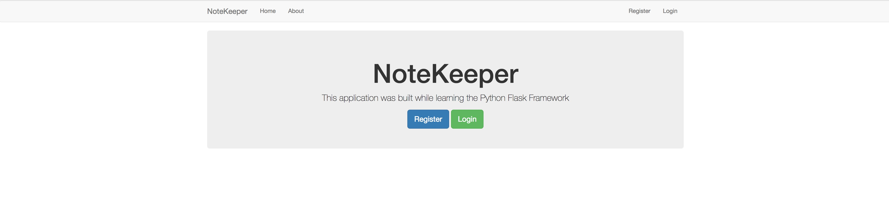
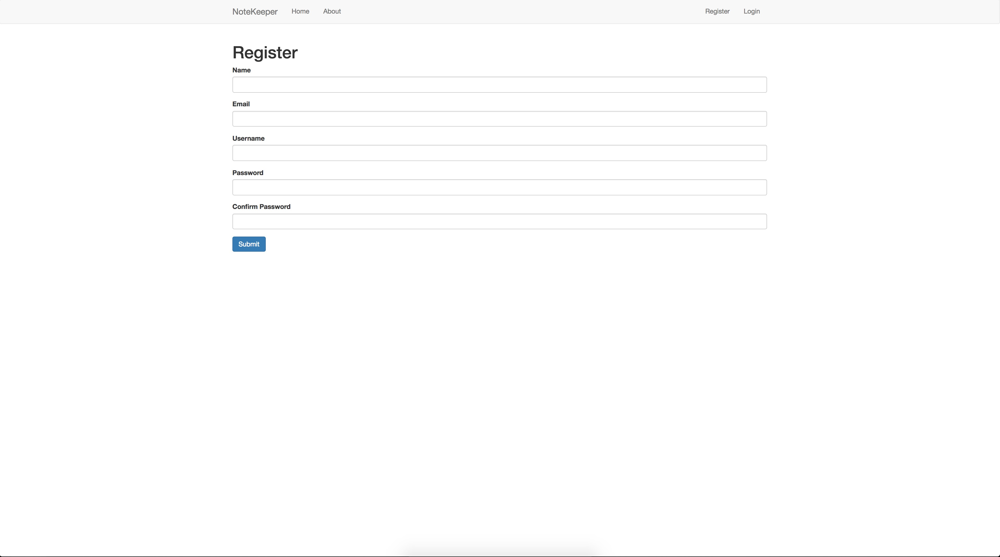
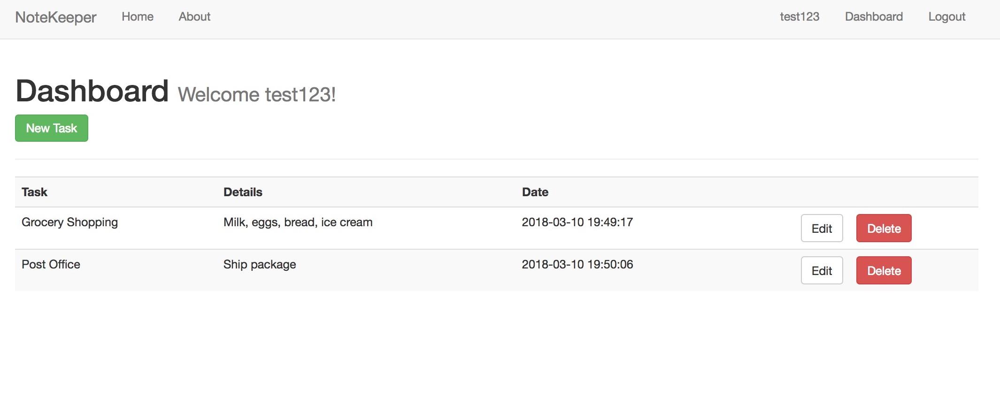
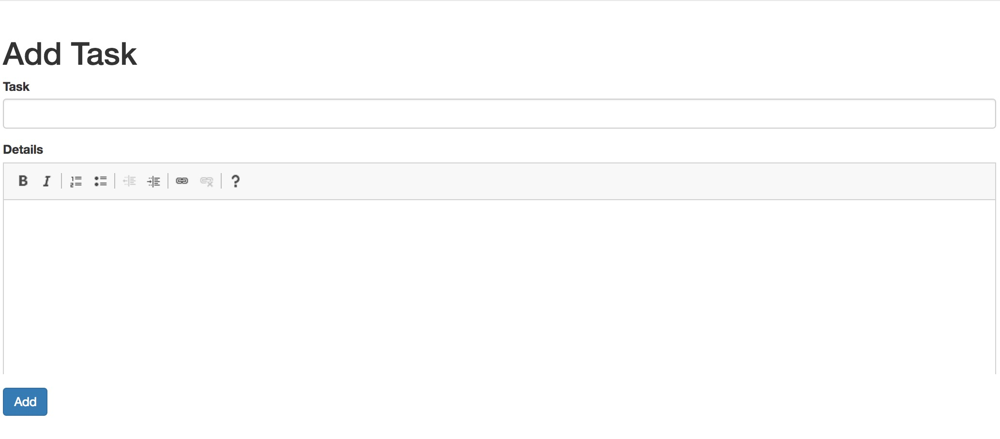
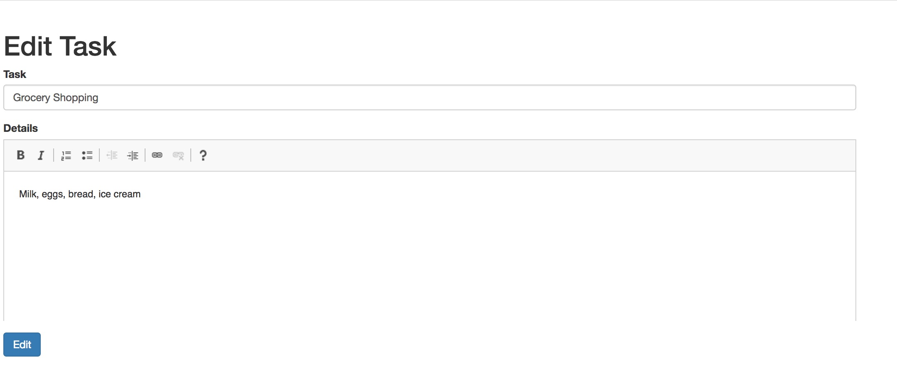
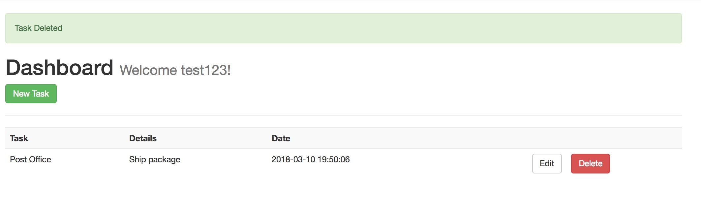

# NoteKeeper

Simple web app using the Flask micro framework.    
NoteKeeper allows for a user to register, login, and create tasks/reminders. The application supports multiple users 
using a MySQL database. 

## Homepage

 
 

## Register

 
 

## User Dashboard

 
 

## Add a Task

 
 

## Edit a Task

 
 

## Delete a Task

 
 

